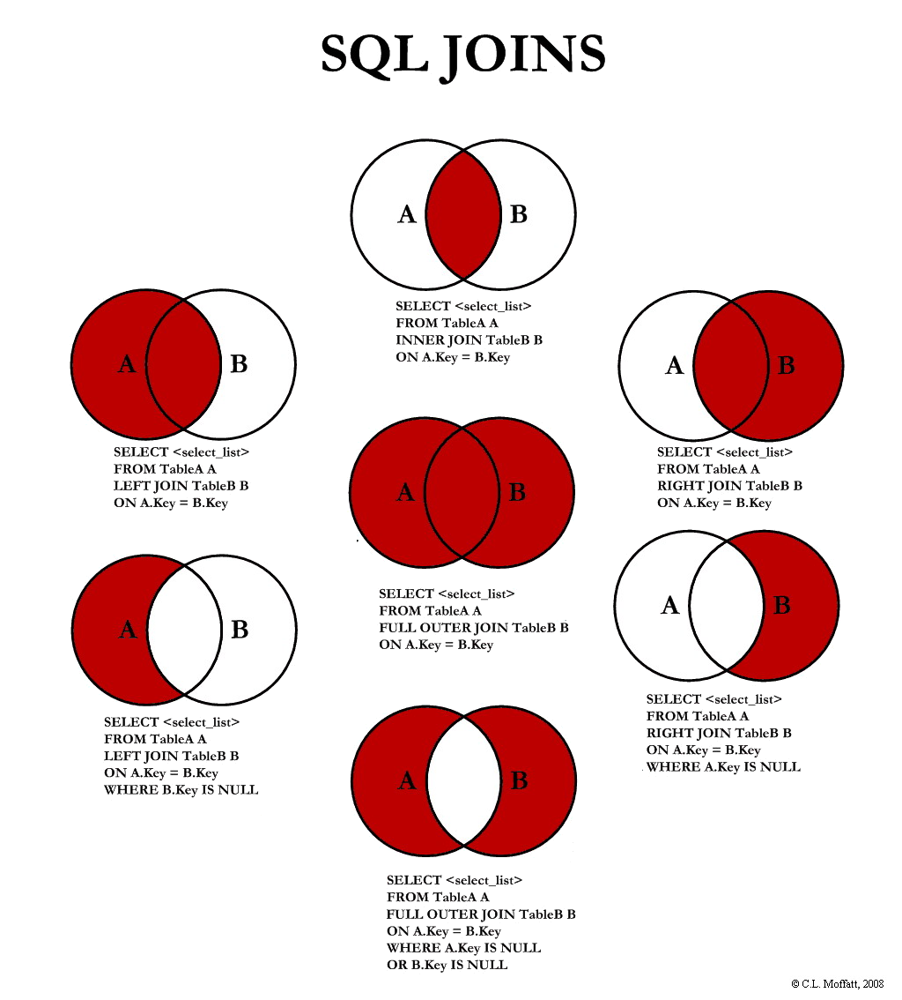
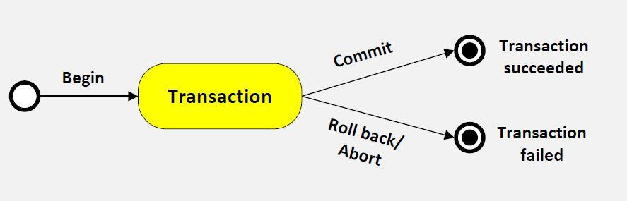
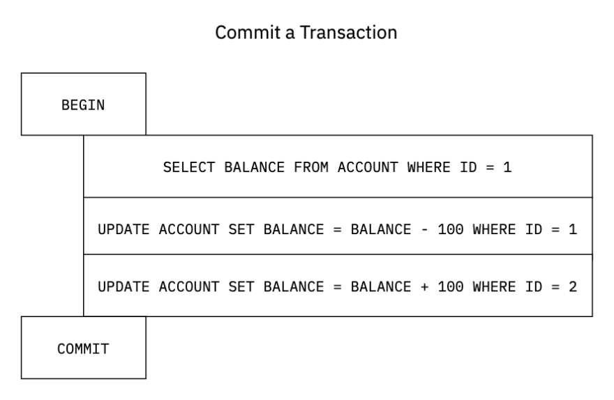

# Banco de Dados 

 


### Fundamentos de Banco de Dados
- [Modelagem](modelagem)
- [Normalização](normalizacao)
- [Álgebra e cálculo relacional](algebra_e_calculo)
- [SQL: aulas](sql/aulas)
- [SQL: exercícios resolvidos](sql/exercicios)
- [SQL: execução dos exercícios resolvidos direto no navegador](https://colab.research.google.com/drive/1_X-KgO7pNk_VU2w52FVcyHsSCjRLnsiE?usp=sharing)
 
---

### Banco de Dados II
- [Tuning em banco de dados](bd_II)
- [Seminário sobre a rede Tangle (blockchain 3.0)](bd_II/exercicios/seminario_rede_tangle.pptx)

---

### Banco de Dados III
 - [Banco de dados orientado à objetos: aulas](bd_III/banco_de_dados_SQL/aulas/bd_orientado_a_objetos)
 - [Banco de dados orientado à objetos: exercícios](bd_III/banco_de_dados_SQL/exercicios/exercicios_bdoo)
 - [Bancos de Dados Temporais: aulas](bd_III/banco_de_dados_SQL/aulas/bd_temporais)
 - [Bancos de Dados Temporais: exercícios](bd_III/banco_de_dados_SQL/exercicios/exercicios_bdt)
 - [Bancos de Dados Geográficos: aulas](bd_III//banco_de_dados_SQL/aulas/bd_geograficos)
 - [Bancos de Dados Geográficos: exercícios](bd_III//banco_de_dados_SQL/exercicios/exercicios_bdgeograficos)
 - [Bancos de Dados XML: aulas](bd_III//banco_de_dados_SQL/aulas/bd_xml)
 - [Bancos de Dados XML: exercícios](bd_III//banco_de_dados_SQL/exercicios/exercicios_bd_xml)
 - [Not only (NoSQL)](bd_III//banco_de_dados_noSQL)
 - [New SQL](bd_III//banco_de_dados_newSQL)
 
---

## **Noções Básicas** 

<details>	
  <summary><a> Linguagens SQL</a></summary>

  - **DDL** (Linguagem de Definição de Dados), que lida com esquemas e descrições de banco de dados.
  - **DML** (Linguagem de Manipulação de Dados), que lida com a manipulação de dados e inclui instruções SQL mais comuns, como SELECT, INSERT, UPDATE, DELETE etc.
  - **DCL** (Linguagem de Controle de Dados), que inclui comandos como GRANT, e principalmente relacionado com direitos, permissões e outros controles do sistema de banco de dados.
  <br/>
</details>

<details>	
  <summary><a> Tipos de Dados</a></summary>

  [Cheat Sheet](https://gist.github.com/janikvonrotz/6e27788f662fcdbba3fb#datatypes)
  <br/>
</details>

<details>	
  <summary><a> SQL Joins</a></summary>

   
  <br/>
</details>

---

<br/>

### **Transações**
Transação em banco de dados é uma coleção de várias operações ex: `SELECT`, `UPDATE`, `DELETE` ou `INSERT` como uma **única unidade de trabalho**.
<br/>
Podemos definir onde a transação começará e quando terminará. Para iniciar a transação, usamos a sintaxe `BEGIN`.
<br/>
Se as consultas em uma transação foram executadas com sucesso, salvamos as alterações usando a sintaxe `COMMIT`. Se as consultas em uma transação falharem na execução, então reverteremos as alterações antes da execução da transação usando a sintaxe `ROLLBACK`.

 

Ex:
```sql
SELECT BALANCE FROM ACCOUNT WHERE ID = 1
UPDATE ACCOUNT SET BALANCE = BALANCE - 100 WHERE ID = 1
UPDATE ACCOUNT SET BALANCE = BALANCE + 100 WHERE ID = 2
```

 

 

<br/>

<details>	
  <summary><a> Propriedades das Trasações</a></summary>
  
  Todo banco de dados RELACIONAL deve possuir as propriedades ACID:
  - **ATOMICIDADE**: todas as operações de uma transação são realizadas. Isso significa que em caso de sucesso deve ser executada totalmente e em casos de erros ou falhas deve ser abortada por completo.
  - **CONSISTENCIA**: leva o DB de um estado consistente para outro estado consistente.
  - **INDEPENDENCIA**: o processamento de transações não deve interferir em outras transações.
  - **DURABILIDADE**: resultados de operações confirmadas não devem interferir em outras transações.
  <br/>
</details>

<details>	
  <summary><a> Controle de transações</a></summary>
  
  Controle de transações serve para garantir as caracteristicas fundamentais de uma transação (ACID).
  
  <br/>
</details>


<details>	
  <summary><a> Protocolo 2phase commit</a></summary>
  
  - Preparação: um dos participantes é eleito coordenador e envia a cada nodo uma solicitação para preparar para o commit.
  - Commit: se todos os nodos participantes estão prontos, o coordenador envia um sinal de commit para cada participante e depois executa
    - Se um nodo falhar na preparação do coomit, o coordenador manda um sinal de rollback para todos.
    - Se o nodo coordenador cair: haverá um backup que será eleito. Em seguida por broadcast, os outros nodos são avisados da mundança.
  
  <br/>
</details>

---

<br/>

### **Deadlocks**
Lock é quando uma ação está sendo tomada em um banco de dados e para evitar a concorrência de 2 comandos em cima do mesmo registro ou tabela, um lock (travamento) é executado. Quando um lock é ativo a transação por sua vez aguarda o unlock (destravamento) da tarefa que estava a sua frente para assim poder ser executada. 
<br/>
Já o DeadLock, é um caso que ocorre nos bancos de dados quando são feitos muitos lock’s que dependem de outros lock’s para prosseguirem, causando uma fila eterna de bloqueio.

 

<br/>

Isso causa um ciclo de dependências (dependência cíclica) e assim impedindo que qualquer tarefa possa ser executada. Geralmente em casos assim, os SGBD’s cancelam ambas as transações para que as próximas possam ser realizadas.

---

<br/>

### **Otimização de Consultas**
É sempre necessário levar em conta:
- replicação dos dados
- reconstrução das relações a partir de fragmentos
- tempo de recuperação
- tempo de processamento
- transmissão pela rede

#### Fragmentação de Dados
Um dado ou relação será fragmentado e armazenado em diferentes nodos.<br>
A fragmentação pode ser de 2 formas:
- Horizontal: os fragmentos são definidos por SELEÇÃO
- Vertical: os fragmentos são definidos por PROJEÇÃO

---

<br/>

### **Livros de Referência**
- [Sistemas de Banco de Dados - Elmasri e Navathe - 6ª Edicao](https://github.com/brunocampos01/banco-de-dados/blob/master/livros/Sistemas%20de%20Banco%20de%20Dados%20navathe%206%C2%AA%20Edicao.pdf)
- [Sistemas de Gerenciamento de Banco de Dados - Ramakrishnan e Gehrke - 6ª Edicao](https://github.com/brunocampos01/banco-de-dados/blob/master/livros/Sistemas%20de%20Gerenciamento%20de%20Banco%20de%20Dados%20-%203%C2%AA%20Ed.pdf)
- [Use a cabeca - SQL](https://github.com/brunocampos01/banco-de-dados/blob/master/livros/Use%20a%20Cabeca%20-%20SQL.pdf)

---

<p  align="left">
<br/>
<a href="mailto:brunocampos01@gmail.com" target="_blank">
</a>
<a href="https://stackoverflow.com/users/8329698/bruno-campos" target="_blank">
</a>
<a href="https://www.linkedin.com/in/brunocampos01" target="_blank"></a>
<a href="https://github.com/brunocampos01" target="_blank"></a>
<a href="https://medium.com/@brunocampos01" target="_blank">
</a>
<a rel="license" href="http://creativecommons.org/licenses/by-sa/4.0/"></a><br/>
</p>
