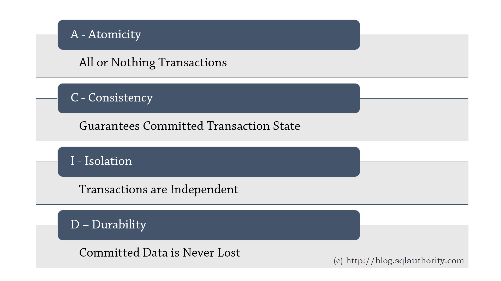
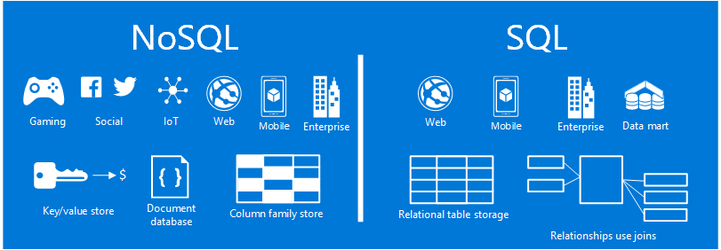

# NewSQL

É a junção do melhor em BD relacional + BD NoSQL.
 

 

- **BD Relational** - são bons em consultas complexas e suportam ACID, porém não são bons para big data por questões de escalabilidade.

 
 

- **BD NoSQL** - são bons para escalar e uma boa escolha para big data, porém não se preocupam com o ACID(consistencia) e não suportam consultas complexas em SQL.
 

 
    
## Utilização:
- Aplicações com alto processamento OLTP. Ex: e-commerce
- Aplicações real time. Ex: games online
- Aplicações Big Data Analytics. Ex: stock market para analisar tendencias de preços.

## Diferente de Data WareHouse:
- São OLTPs
- Há atualizações
- Analisam dados em larga escala em real time.

## Características:
- Particionamento
- Controle de concorrência (scheduler)
- Replicação
- Recovery

